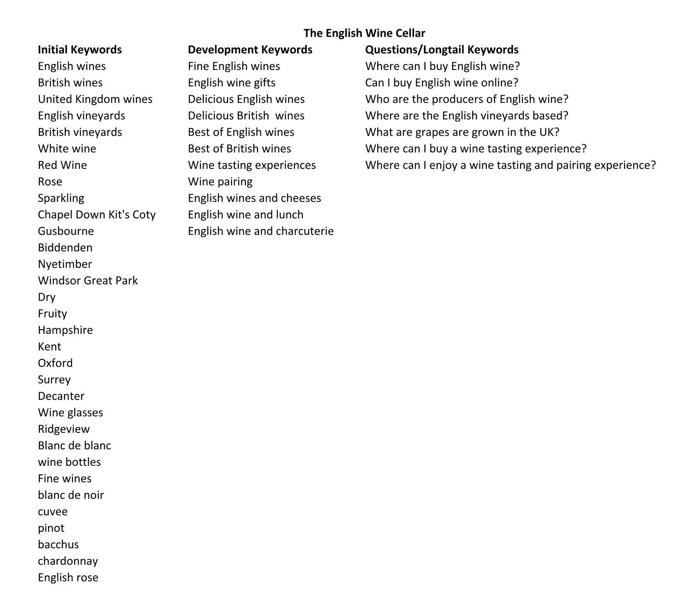

#  The English Wine Cellar 

# Introduction
The English Wine Cellar is an online retailer of English wines and wine accessories. They also provide wine tasting experiences to compliment their core business.

### The Emergence of the British Wine Industry
In the past, English wine was thought of as being below the standards of European wines and those from warmer climes, as England didn't have the required climate or expertise.

This has changed in recent years, partly due to customer perception and the emphasis on 'buying local' by ethically minded consumers in order to contribute to a healthy environment.

Britain's changing climate and knowledgeable winemakers has meant that the UK can now compete with their continental neighbours in regard to producing good quality wine.

However, Britain cannot, at present, produce the quantities to match those from other major wine producing regions. The lower yield and supply of British wines, means that the cost to the end consumer will be high.

The live website can be found [here](https://the-english-wine-cellar.herokuapp.com/)

# Contents
* [Planning](#planning)
* [Development](#development)
* [Features](#features)
* [Marketing](#marketing)
* [Technologies](#technologies)
* [Testing](#testing)
* [Deployment](#deployment)
* [Credits](#credits)
* [Acknowledgements](#acknowledgements)

## Planning
### Business Model

The English Wine Cellar is a B2C ecommerce retailer of English wines. In addition they sell glassware and provide wine tasting experiences to complement their core product offering.

The business' target audience have the following attributes:

- Mid 30s - late 40s
- Professional
- High disposable income (money no object)
- Enjoy finer things in life
- Appreciate quality
- Repeat buyers

### Problem Statement
The number of outlets for English wines are smaller in number than the imported wines from other regions. This is due to the emergence of the home grown product being a relative new entrant to market and low quantities produced. This is not a mass market product, but quite niche in that it is defined by quality and price. Availability is limited to high end outlets and direct from the winemakers/vineyards.

### Project Objectives
- The objectives of the site is to drive sales of English wines through a B2C web application, including the provision of wine tasting experiences that can be booked online.

### User Experience (UX) Goals

Journey Map - touch points:

  

### External User's Goal
- Users can purchase good quality English wines and/or book tasting experiences. They can also purchase wine accessories, such as wine glasses and decanters.

### Site Owner's Goal
- Sell English/British wines within the UK to consumers (B2C).
- Promote English wines, educate potential customers and encourage repeat business.

### User Expectations
- The website should have a simple interface which is easily navigable.
- The website should be responsive on all types and sizes of devices.
- The website should provide responsive feedback to the users' interaction with the site e.g. success or error messages following an interaction.

## Development
## User Stories Epics & Sprints
Github projects board was used to store the work backlog and as a Kanban board. Issues were created to replicate user story tickets, grouped into epics and sprints. Also the MoSCoW principle was used to prioritise the development of the site.
#### User Stories

    

 

### Sprints

There are some features that were not completed, (or are still work in progress), in this phase of the project, and will therefore be included in the next phase.

### Phase 1
- Display a range wines, glassware and experiences
- Allow users to register for an account
- Allow users to create and edit their personal profile
- Responsive design
- Ability to add/edit/delete products
- Ability to subscribe and unsubscribe to the newsletter
- Allow the customer to enter payment information securely
- Allow customer to select a booking date for their experience

### Phase 2
- Complete wish list
- Add age verification
- Enable site owner to send out emails to newsletter subscribers
- Add the ability for users to rate and review experiences
- Add a facility for vouchers and discounts to be given in marketing the site and enable users to use them
- Add ability for site owner to add, update and delete experiences from the frontend.

## Database Schema (ERD)

## Wireframes

    

Home

Product

Product detail

Wine tasting experience

Wine tasting experience detail

Basket

Checkout

Email Confirmation

Login

Register

Mobile frames

## Surface
- Colour Scheme
The following colour palette has been used for the website, giving it a sophisticated and elegant look. The colour scheme is simple and clean with great contrast. Splashes of colour are provided by the product and experience images.

- Typography
The font family used is Lato due to its simplicity, which is in keeping with the site's overall feel. The font is also easy to read and unfussy.

- Logo
The logo was created through Wix, keeping the image simple and using the same palette as the website.

## Features & Responsive Design

- Navigation bar:
Contains the company logo, which is also a home link from anywhere on the site. It also contains links to other site pages, as well as a search bar. The account (registration, login, profile management and product management), booking and basket sessions are located far right.

Both the booking and basket sessions change colour when there are items in them.

In order to manage products frontend (rather than from the admin panel), the super user needs to login, at which point the link to the form for adding, updating and deleting products becomes visible.

- Footer:
Contains links to social media sites, along with links to login, register, drinkaware and WineGB (the latter two are external sites, giving credibility and authority to The English Wine Cellar). The footer also contains the newsletter form for subscribers and a link to un subscribe.

- Main body of the home page contains image links to the respective pages, which are clearly marked. There is also a call to action button, which links the user to the products page.

- Contact details can be found on the wine tasting experience page. This includes a physical address and an embedded Google map, which is responsive.

- The date picker in the experience detail page will not allow the user to select a date in the past. It is also a required field.

- When the user checksout from the basket/booking, the experience and/or product will appear in the summary on the checkout form.

## Technologies
-   HTML5 - HyperText Markup Language
-   CSS - Cascading Style Sheets
-   Python and JavaScript - programming languages
-   Django framework
-   Bootstrap 4 for inline styling
-   ElephantSQL for postgreSQL database.
-   Amazon Web Services (AWS) for static and media files
-   Gitpod code editor
-   Heroku hosting platform
-   Balsamiq for the wireframes during planning proces
-   Google fonts 
-   GitHub - store project repository

## Marketing
- Search Engine Optimisation (SEO):
To enhance SEO for the site, keywords were added in a meta tag to the base.html. Key words were researched through WordTracker and similar sites.

Some of the words will have a high rate of competition, but the more unusual or long-tail keywords will have less competition for ranking.

- Social Media:
An attempt was made to create a Facebook page for the site but this was unsuccessful. However, a wireframe mock up has been created in anticipation of creating the actual page.

Due to the coverage of Facebook, this would be a lucrative marketing and advertising avenue for the business.

## Testing & Validating

## Deployment

### Stripe

    

### Deploy with Heroku

    

### Pre Production Deployment

    

## Credits & Acknowledgements
