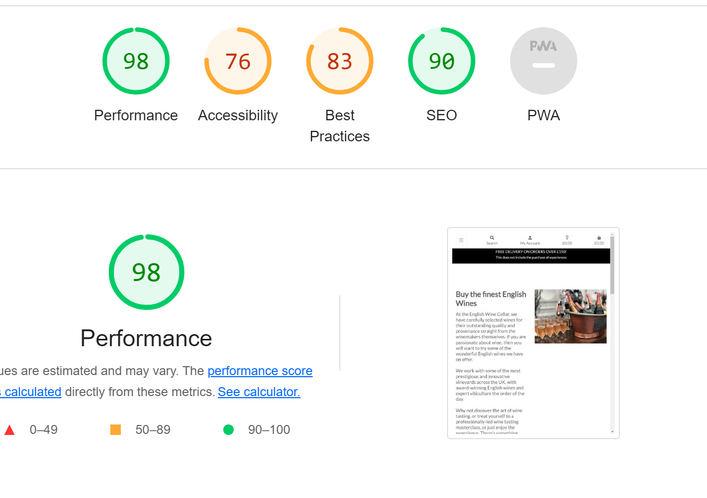

#  The English Wine Cellar 

# Introduction
The English Wine Cellar is an online retailer of English wines and wine accessories. They also provide wine tasting experiences to compliment their core business.

### The Emergence of the British Wine Industry
In the past, English wine was thought of as being below the standards of European wines and those from warmer climes, as England didn't have the required climate or expertise.

This has changed in recent years, partly due to customer perception and the emphasis on 'buying local' by ethically minded consumers in order to contribute to a healthy environment.

Britain's changing climate and knowledgeable winemakers has meant that the UK can now compete with their continental neighbours in regard to producing good quality wine.

However, Britain cannot, at present, produce the quantities to match those from other major wine producing regions. The lower yield and supply of British wines, means that the cost to the end consumer will be high.

The live website can be found [here](https://the-english-wine-cellar.herokuapp.com/)

# Contents
* [Planning](#planning)
* [Development](#development)
* [Features](#features)
* [Marketing](#marketing)
* [Technologies](#technologies)
* [Testing](#testing)
* [Deployment](#deployment)
* [Credits](#credits)
* [Acknowledgements](#acknowledgements)

## Planning
### Business Model

The English Wine Cellar is a B2C ecommerce retailer of English wines. In addition they sell glassware and provide wine tasting experiences to complement their core product offering.

The business' target audience have the following attributes:

- Mid 30s - late 40s
- Professional
- High disposable income (money no object)
- Enjoy finer things in life
- Appreciate quality
- Repeat buyers

### Problem Statement
The number of outlets for English wines are smaller in number than the imported wines from other regions. This is due to the emergence of the home grown product being a relative new entrant to market and low quantities produced. This is not a mass market product, but quite niche in that it is defined by quality and price. Availability is limited to high end outlets and direct from the winemakers/vineyards.

### Project Objectives
- The objectives of the site is to drive sales of English wines through a B2C web application, including the provision of wine tasting experiences that can be booked online.

### User Experience (UX) Goals

Journey Map - touch points:

  

### External User's Goal
- Users can purchase good quality English wines and/or book tasting experiences. They can also purchase wine accessories, such as wine glasses and decanters.

### Site Owner's Goal
- Sell English/British wines within the UK to consumers (B2C).
- Promote English wines, educate potential customers and encourage repeat business.

### User Expectations
- The website should have a simple interface which is easily navigable.
- The website should be responsive on all types and sizes of devices.
- The website should provide responsive feedback to the users' interaction with the site e.g. success or error messages following an interaction.

## Development
## User Stories Epics & Sprints
Github projects board was used to store the work backlog and as a Kanban board. Issues were created to replicate user story tickets, grouped into epics and sprints. Also the MoSCoW principle was used to prioritise the development of the site.
#### User Stories

    

 

### Sprints

There are some features that were not completed, (or are still work in progress), in this phase of the project, and will therefore be included in the next phase.

### Phase 1
- Display a range wines, glassware and experiences
- Allow users to register for an account
- Allow users to create and edit their personal profile
- Responsive design
- Ability to add/edit/delete products
- Ability to subscribe and unsubscribe to the newsletter
- Allow the customer to enter payment information securely
- Allow customer to select a booking date for their experience

### Phase 2
- Complete wish list
- Add age verification
- Enable site owner to send out emails to newsletter subscribers
- Add the ability for users to rate and review experiences
- Add a facility for vouchers and discounts to be given in marketing the site and enable users to use them
- Add ability for site owner to add, update and delete experiences from the frontend.

## Database Schema (ERD)

## Wireframes

    

Home

Product

Product detail

Wine tasting experience

Wine tasting experience detail

Basket

Checkout

Email Confirmation

Login

Register

Mobile frames

## Surface
- Colour Scheme
The following colour palette has been used for the website, giving it a sophisticated and elegant look. The colour scheme is simple and clean with great contrast. Splashes of colour are provided by the product and experience images.

- Typography
The font family used is Lato due to its simplicity, which is in keeping with the site's overall feel. The font is also easy to read and unfussy.

- Logo
The logo was created through Wix, keeping the image simple and using the same palette as the website.

## Features & Responsive Design

- Navigation bar:
Contains the company logo, which is also a home link from anywhere on the site. It also contains links to other site pages, as well as a search bar. The account (registration, login, profile management and product management), booking and basket sessions are located far right.

Both the booking and basket sessions change colour when there are items in them.

In order to manage products frontend (rather than from the admin panel), the super user needs to login, at which point the link to the form for adding, updating and deleting products becomes visible.

- Footer:
Contains links to social media sites, along with links to login, register, drinkaware and WineGB (the latter two are external sites, giving credibility and authority to The English Wine Cellar). The footer also contains the newsletter form for subscribers and a link to un subscribe.

- Main body of the home page contains image links to the respective pages, which are clearly marked. There is also a call to action button, which links the user to the products page.

- Contact details can be found on the wine tasting experience page. This includes a physical address and an embedded Google map, which is responsive.

- The date picker in the experience detail page will not allow the user to select a date in the past. It is also a required field.

- When the user checksout from the basket/booking, the experience and/or product will appear in the summary on the checkout form.

- Following the successful completion of the order, the customer will receive a confirmation notice of their order.

## Technologies
-   HTML5 - HyperText Markup Language
-   CSS - Cascading Style Sheets
-   Python and JavaScript - programming languages
-   Django framework
-   Bootstrap 4 for inline styling
-   ElephantSQL for postgreSQL database.
-   Amazon Web Services (AWS) for static and media files
-   Gitpod code editor
-   Heroku hosting platform
-   Balsamiq for the wireframes during planning proces
-   Google fonts 
-   GitHub - store project repository

## Marketing
- Search Engine Optimisation (SEO):
To enhance SEO for the site, keywords were added in a meta tag to the base.html. Key words were researched through WordTracker and similar sites.

Some of the words will have a high rate of competition, but the more unusual or long-tail keywords will have less competition for ranking.

- Social Media:
An attempt was made to create a Facebook page for the site but this was unsuccessful. However, a wireframe mock up has been created in anticipation of creating the actual page.

Due to the coverage of Facebook, this would be a lucrative marketing and advertising avenue for the business.

## Testing & Validating

- Lighthouse was used to test accessibility

- W3C Markup was used to check for errors for html pages. There were recurring errors that were related to Django, so these were ignored.

- There were no errors for the CSS files.

- JS Hint was used to check the JavaScript files. There were warnings, but no errors.

### Manual Testing

The site has been tested on smaller devices (Iphone SE being the smallest) in devtools.

### Navigation

All Pages:
TEST            | OUTCOME                          | PASS / FAIL  
--------------- | -------------------------------- | ---------------
Home | Upon clicking the "Home" link in the navigation bar or on the business logo, the browser redirects the user to the home page. | PASS
Navigation Links Within the Home Page | Upon clicking the "Browse Our Cellar" link, the browser directs the user to the Products page. Upon clicking on the smaller image links below the main "Hero" image directs the user to the respective filtered pages of the products, and the wine tasting experience page. | PASS
All Products | Upon clicking the "All Products" link in the navigation bar, a dropdown menu is revealed giving access to the user to sort/filter options, as well as a link to the "All Products" page. The user will be aware that they are on this page by the page heading. The various filters when clicked on will filter the products according to category filter, and can be seen how they have been filtered on the products page.| PASS
Wine, Glassware & Specials filters| Upon clicking the catgory filters in the navigation bar, dropdown menus are revealed for those particular products - each filter provides categories which sort the products accordingly.| PASS
Wine Tasting | Upon clicking the "Wine Tasting" link in the navigation bar, the browser directs the user to the wine tasting experiences page. The user will be aware that they are on this page by the page heading. | PASS
My Account | Upon clicking on "My Account", a dropdown menu is presented with links to "Register" and "Login" in the navigation bar (if not logged-in). If logged-in a "Logout" and "My Profile" links are also presented, (if superuser/administrator - then an "Add Product" link is presented as well). In all cases the browser redirects the user to the respective pages. The user will be aware of the pages they are on as they all have page headings. | PASS
Basket/Booking | Upon clicking the "Basket" of "Wine Glass" icon in the navigation bar, the browser redirects the user to the basket or booking page accordingly. The user will be aware of  the pages they are on as the pages have the appropriate headings. | PASS
Search Bar | When searching for a keyword, the results will show products that contain the keyword in the product name or description. This does not apply to searching wine tasting experiences as there are very small number of experiences on offer and do not require a search facility.| PASS
Product/Wine Tasting Experience Detail | Upon clicking on either the product image within the product page or the experience on the wine tasting page, the user will be directed to the detail page giving extensive detail about the product or experience.| PASS

### Home Page
TEST            | OUTCOME                          | PASS / FAIL  
--------------- | -------------------------------- | ---------------
Media | All media is displayed properly and have no pixelation/stretched images, and are responsive on all devices. | PASS
Responsiveness | All elements on the page have been checked for consistency and scalability in mobile, tablet and desktop view.| PASS

### Products/Wine Tasting Pages
TEST            | OUTCOME                          | PASS / FAIL  
--------------- | -------------------------------- | ---------------
pixelation/stretched images, and are responsive on all devices. | PASS
Responsiveness | All elements on the page have been checked for consistency and scalability in mobile, tablet and desktop view.| PASS
Sort filter | The sort/filter functionality, for products only, has been checked by selecting each option - eEach time the page reloads and sorts the products accordingly. | PASS
Edit/Delete Button (only applies to products and for super user/administrator only) | The edit/delete button is only accessible if the user is logged in as a super user/administrator. | PASS

- Known bug in the booking sessions; when multiples of the same product with different dates is updated or removed it removes the item by id regardless of the date.

## Deployment

1. I used Elephant, elephantsql.com, and click 'Get a managed database today'. I chose the free 'Tiny Turtle' plan.
2. Select “Log in with GitHub” and authorize ElephantSQL with selected GitHub account.
3. In the Create new team form:
    * Add a team name (your own name is fine).
    * Read and agree to the Terms of Service.
    * Select Yes for GDPR.
    * Provide your email address.
    * Click “Create Team”.
4. Your account should now be created.
5. Now you will need to create your database. Navigate to your elephantsql.com dashboard, and click "Create New Instance".
6. Set up your plan:
    * Give your plan a Name (this is commonly the name of the project).
    * Select the Tiny Turtle (Free) plan.
    * You can leave the Tags field blank.
7. Select a data center near you.
8. Then click "Review".
9. Check your details are correct and then click "Create Instance".
10. Return to the ElephantSQL dashboard and click on the database instance name for this project.
11. You will return to this projects dashboard as part of the steps to 'Deploy with Heroku' as you will need the DATABASE_URL.

Gmail SMTP has been used to send order confirmations and user contact emails in the deployed version. To use this configuration, copy and adapt the code below into your settings.py file.

if 'DEVELOPMENT' in os.environ:
    EMAIL_BACKEND = 'django.core.mail.backends.console.EmailBackend'
    DEFAULT_FROM_EMAIL = 'theenglishwinecellar@example.com'
else:
    EMAIL_BACKEND = 'django.core.mail.backends.smtp.EmailBackend'
    EMAIL_USE_TLS = True
    EMAIL_PORT = 587
    EMAIL_HOST = 'smtp.gmail.com'
    EMAIL_HOST_USER = os.environ.get('EMAIL_HOST_USER')
    EMAIL_HOST_PASSWORD = os.environ.get('EMAIL_HOST_PASS')
    DEFAULT_FROM_EMAIL = os.environ.get('EMAIL_HOST_USER')

Amazon Web Services (AWS) Storage

Considering the development of the site could require a significant volume of product images, AWS has been used as the cloud host for imagery. To implement this you will need and AWS account and to create an S3 Bucket and User Profile. Developer guidance can be followed on AWS's site.

To serve the images you will need to add the following config to your settings.py file.

if 'USE_AWS' in os.environ:

    # Cache control
    AWS_S3_OBJECT_PARAMETERS = {
        'Expires': 'Thu, 31 Dec 2099 20:00:00 GMT',
        'CacheControl': 'max-age=94608000',
    }

    # Bucket Config
    AWS_STORAGE_BUCKET_NAME = 'the-english-wine-cellar'
    AWS_S3_REGION_NAME = 'eu-west-2'
    AWS_ACCESS_KEY_ID = os.environ.get('AWS_ACCESS_KEY_ID')
    AWS_SECRET_ACCESS_KEY = os.environ.get('AWS_SECRET_ACCESS_KEY')
    AWS_S3_CUSTOM_DOMAIN = f'{AWS_STORAGE_BUCKET_NAME}.s3.amazonaws.com'

    # Static and media files
    STATICFILES_STORAGE = 'custom_storages.StaticStorage'
    STATICFILES_LOCATION = 'static'
    DEFAULT_FILE_STORAGE = 'custom_storages.MediaStorage'
    MEDIAFILES_LOCATION = 'media'

    # Override static and media URLs in production
    STATIC_URL = f'https://{AWS_S3_CUSTOM_DOMAIN}/{STATICFILES_LOCATION}/'
    MEDIA_URL = f'https://{AWS_S3_CUSTOM_DOMAIN}/{MEDIAFILES_LOCATION}/'

Stripe

Stripe has been used to receive payments from customers. To implement you need to have an account with Stripe and follow the instructions add incorporate the guided HTML, Python and JavaScript code. Ensure to add the secret key generated with Stripe to your Heroku Config Vars.

Once Stripe is activate you can test the checkout process with a test credit card detail provided by Stripe. Please use these details (below) and not real card details as there is no guarantee monies can be returned as this is a fictitious site.

| CARD NO             | MM / YY | CVC | Post Code |
| ------------------- | ------- | --- | --------- |
| 4242 4242 4242 4242 | 04 / 24 | 242 | 42424     |

Deploy with Heroku

1. Log in to Heroku at https://heroku.com - create an account if required.
2. From the Heroku dashboard, click the Create new app button. For a new account an icon will be visible on screen to allow you to Create an app, otherwise a link to this function is located under the New dropdown menu at the top right of the screen.
3. On the Create New App page, enter a unique name for the application and select region. Then click Create app.
4. On the Application Configuration page for the new app, click on the Resources tab.
5. Next, click on Settings on the Application Configuration page and click on "Reveal Config Vars".
6. Add a new Config Var called DISABLE_COLLECTSTATIC and assign it a value of 1, and click Add to save it. Remove this when releasing for Production.
7. Add a new Config Var called SECRET_KEY and assign it a value - any random string of letters, digits and symbols, and click Add to save it.
8. Add a new Config Var called DATABASE_URL and paste in the value for your ElephantSQL database, and click Add to save it.
9. The settings.py file should be updated to use the DATABASE_URL and SECRET_KEY environment variable values as follows :

        DATABASES = {'default': dj_database_url.parse(os.environ.get('DATABASE_URL'))}

        SECRET_KEY = os.environ.get('SECRET_KEY')

10. In Gitpod, in the project terminal window, to initialize the data model in the postgres database, run the command : python3 manage.py migrate
11. Update the requirements.txt file with all necessary supporting files by entering the command : pip freeze > requirements.txt
12. Commit and push any local changes to GitHub.
13. In order to be able to run the application on localhost, add SECRET_KEY and DATABASE_URL and their values to env.py

Connect GitHub Repo to Heroku App

1. Navigate to Application Configuration page for the application on Heroku and click on the Deploy tab.
2. Select GitHub as the Deployment Method and if prompted, confirm that you want to connect to GitHub. Enter and search for the required repository, then click on Connect to link them up..
3. Scroll down the page and choose to either Automatically Deploy each time changes are pushed to GitHub, or Manually deploy - I chose the latter for the initial deployment to watch the build and then opted for Automatic Deployment.
4. The application can be run from the Application Configuration page by clicking on the Open App button.
5. Each time you push code from your GitHub Repo it will be automatically reflected in your Heroku App.

### Pre Production Deployment

When you are ready to move to production, the following steps must be taken to ensure your site works correctly and is secure.

In GitPod:
1. Set DEBUG flag to False in settings.py
2. Check the following line exists in settings.py: X_FRAME_OPTIONS = 'SAMEORIGIN'
3. Update the requirements.txt file with all necessary supporting files by entering the command : pip freeze > requirements.txt
4. Commit and push code to GitHub
In the Heroku App:
5. Settings > Config Vars : Delete environment variable : DISABLE_COLLECTSTATIC
6. Deploy : Click on deploy branch

## Credits & Acknowledgements

* Marcel Mulder, my mentor for his imense support and guidance.

* Code Institute Tutors who supported me consistently throughout this project

* Slack community for support and guidance

* For the framework of the project I have relied on the Code Institutes walkthrough project "Boutique Ado". Stackoverflow for reference to issues with code.
#### Images
Pexel
Adobe Stock
The English Wine Collection

Disclaimer: as this is an educational project and no money is being precured, the images/words taken from sites are permissible.
